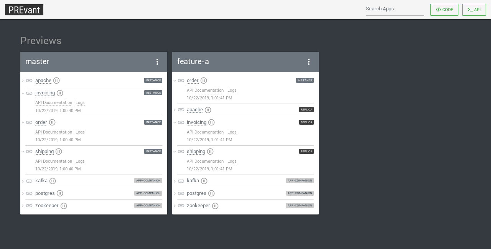

[](https://hub.docker.com/r/aixigo/prevant)
[](./LICENSE)

# PREvant In a Nutshell

PREvant is a web-based software tool that acts as a testing and review platform,
simplifying the deployment and management of microservices for development
teams. Operating as a Docker container, it connects continuous integration
pipelines with container orchestration platforms, allowing developers to ensure that
features align with domain expert requirements. PREvant's RESTful API helps to
integrate microservices from different branches (in multi-repo development
setups) into reviewable applications, creating preview environments for testing
new features before they are finalized. This reduces the complexity and speeds
up the development process, aligning with agile methodologies.

The name PREvant short for _Preview servant_, pronounced like "prevent"
(`prɪˈvɛnt`), reflects its role in preventing development errors by enabling
early reviews through its web interface, where stakeholders can assess and give
feedback on application developments efficiently.   


Through PREvant's web interface domain experts, managers, developers, and sales
experts can review and demonstrate the application development.




## Basic Terminology

An *application*, that PREvant manages, is a composition of microservices based
on an “architectural pattern that arranges an application as a collection of
loosely coupled, fine-grained services, communicating through lightweight
protocols.”  ([Wikipedia][wiki-microservices]) Each application has a unique
name which is the key to perform actions like creating, duplicating, modifying,
or deleting these applications via REST API or Web UI.

In each application, PREvant manages the microservices as *services* which need
to be available in the [OCI Image Format][oci-image-spec] (a.k.a. Docker
images). At least one service needs to be available for an application. PREvant
manages the following kind of services:

- *Instance*: a service labeled as instance is a service that has been
  configured explicitly when creating or updating an application.
- *Replica*: a service labeled as replica is a service that has been replicated
  from another application. By default if you create an application under any name
  PREvant will replicate all instances from the application *master*.
  Alternatively, any other application can be specified as a source of
  replication.


Figure above depicts the separate repositories and continuous delivery pipelines
for microservices (Ms) Ms A, Ms B, and Ms C. During the build stage, each
microservice is packaged as a container image and then pushed to a container
image registry (e.g., a Docker registry), ensuring the services are prepared for
deployment in the acceptance and manual test stages. In the deployment phase,
such as the manual test stage shown in above Figure, the continuous delivery
pipeline can leverage PREvant’s REST API. This REST request creates a
software-defined network, starts the microservice container, connects it to the
network, and configures a reverse-proxy, making the service accessible via
PREvant’s web interface. Subsequent REST calls check for newer versions of the
container image, and if one is found, the container is updated.

## Companions

Additionally, PREvant provides a way of deploying services every time it creates
an application. These services are called *companions* and there are two types
of them.

- Application wide companion (short app companion): is a unique service for the
  entire application. For example, a [Kafka][kafka] instance can be started
  automatically every time an application is created, so that all services
  within the application can synchronize via events.
- Service companion:  A companion can also be attached to a specific service a
  user wants to deploy. For example, a [PostgreSQL][postgres] container can be
  started for each service to provide it with a dedicated database.

Further instructions to configure Companions can be seen
[here](docs/companions.md).

# Usage

In this section, you'll find examples of deploying PREvant in container environments:

- For Docker, refer to [Docker example](examples/Docker/README.md)
- For Kubernetes (requires at least Kubernetes 1.15), refer to [Kubernetes example](examples/Kubernetes/README.md)

To customize the behavior of PREvant, you can mount a TOML file into the container at `/app/config.toml`. More details about the configuration can be found [here](docs/configuration.md).

# Requirements for Your Services

PREvant is able to show the version of your service (build time, version string, and git commit hash) and also to integrate your API specification into the frontend through [Swagger UI](https://swagger.io/tools/swagger-ui/). In order to show the information, PREvant tries to resolve it by using the web-based protocol proposed by [RFC 6415](https://tools.ietf.org/html/rfc6415).

When you request the list of apps and services running through the frontend, PREvant makes a request for each service to the URL `.well-known/host-meta.json` and expects that the resource provides a [host-meta document](http://docs.oasis-open.org/xri/xrd/v1.0/xrd-1.0.html) serialized as JSON:

```json
{
  "properties": {
    "https://schema.org/softwareVersion": "0.9",
    "https://schema.org/dateModified": "2019-04-09T15:31:01.363+0200",
    "https://git-scm.com/docs/git-commit": "43de4c6edf3c7ed93cdf8983f1ea7d73115176cc"
  },
  "links": [
    {
      "rel": "https://github.com/OAI/OpenAPI-Specification",
      "href": "https://example.com/master/service-name/swagger.json"
    }
  ]
}
```

This sample document contains the relevant information displayed in the frontend (each information is optional):

- The software version of the service (see `https://schema.org/softwareVersion`)
- The build time of the service (see `https://schema.org/dateModified`)
- The git commit id of the service (see `https://git-scm.com/docs/git-commit`)
- The link to the API specification (see `https://github.com/OAI/OpenAPI-Specification`)

In order to generate the correct link to the API specification, PREvant adds following headers to each of these requests:

- [`Forwarded` header](https://developer.mozilla.org/en-US/docs/Web/HTTP/Headers/Forwarded) with `host` and `proto`.
- `X-Forwarded-Prefix` (used by some reverse proxies, cf. [Traefik](https://docs.traefik.io/basics/) and [Zuul](https://cloud.spring.io/spring-cloud-static/Finchley.SR1/multi/multi__router_and_filter_zuul.html)).

# Development

In the [Development](docs/Develop.md) section, you can view the detailed guide on,
how to develop/run PREvant.

Developers looking to contribute to PREvant can engage through GitHub by
addressing issues, enhancing documentation, and submitting pull requests. The
project's open-source nature encourages collaboration and innovation from the
developer community.


# Further Readings

PREvant's concept has been published in the [Joint Post-proceedings of the First and Second International Conference on Microservices (Microservices 2017/2019): PREvant (Preview Servant): Composing Microservices into Reviewable and Testable Applications](http://dx.doi.org/10.4230/OASIcs.Microservices.2017-2019.5).
This paper is based on [the abstract](https://www.conf-micro.services/2019/papers/Microservices_2019_paper_14.pdf) that has been published at the conference [_Microservices 2019_ in Dortmund](https://www.conf-micro.services/2019/).

The talk delivered at the conference is available on [YouTube](http://www.youtube.com/watch?v=O9GxapQR5bk). Click on the image to start the playback:

[](http://www.youtube.com/watch?v=O9GxapQR5bk)

[wiki-microservices]: https://en.wikipedia.org/wiki/Microservices
[oci-image-spec]: https://specs.opencontainers.org/image-spec/
[kafka]: https://kafka.apache.org
[postgres]: https://www.postgresql.org
